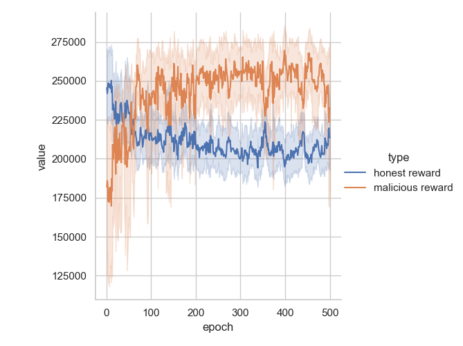
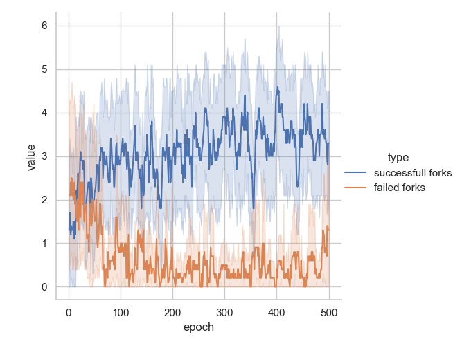

# AGR4BS

AGR4BS python class definitions to serve as a framework for concrete blockchain simulations and study.

[](https://circleci.com/gh/hroussille/agr4bs/tree/master)
[](https://github.com/marketplace/actions/super-linter)

:warning: **This repository is under heavy development and will undergo breaking changes** :warning:

This code was developed during a Ph.D thesis on blockchain systems and MARL, at Montpellier University and is under the MIT license.

## Installation

### Prerequisites

- git
- python 3

### Clone the repository

```sh
    git clone git@github.com:hroussille/agr4bs.git
```

### Install the dependencies

```sh
    cd agr4bs
    git checkout development
    pip install -r requirements.txt
```

## Test suite

To run the entire testsuite, please use :

```sh
    python -m pytest -s
```

## Reinforcement Learning

In the `RL` folder we show the result of a study on Ethereum 2.0 where malicious validators aim at creating forks to increase their protocol rewards.

Those validators, which can either proposer or attester are controlled by DQN models to chose between the honest and malicious strategies.

### Commands

All commands should be run within the RL folder.

#### Training the models

Training the models from scratch can be done with :

```
python train.py --result-folder [PATH] --n-runs [NUMBER OF RUNS] --reward [forks || average]
```

Once the training is complete, the data will be extracted to the PATH specified and can be vizualized.

#### Visualizing the results

Visualizing the results can be done with :

```
python visualize.py --folder PATH
```

Which will display 2 visualizations :

- average malicious vs honest agents rewards across epochs & runs



- average number of successfull vs failed forks across epochs & runs


